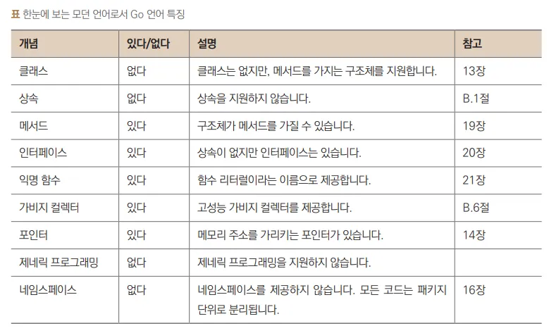
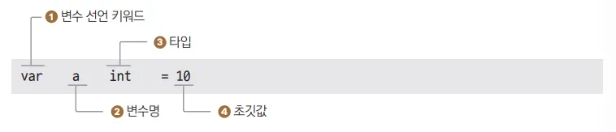
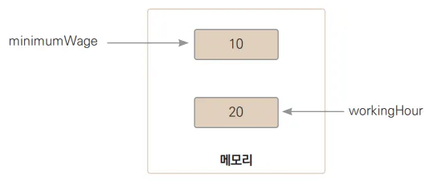
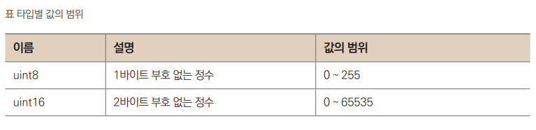
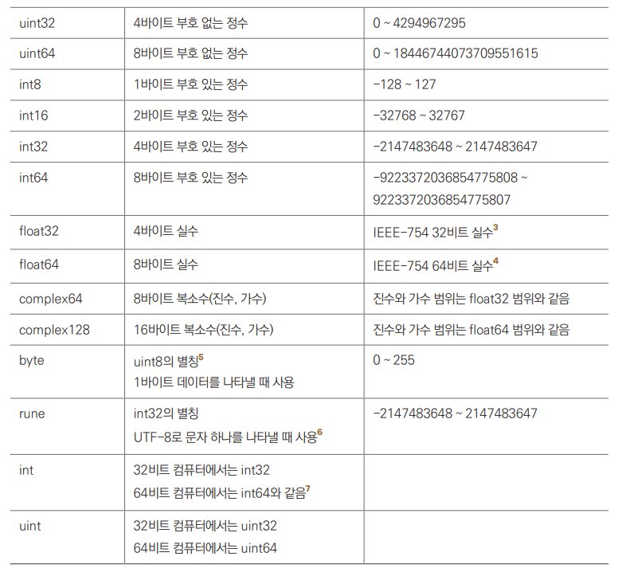
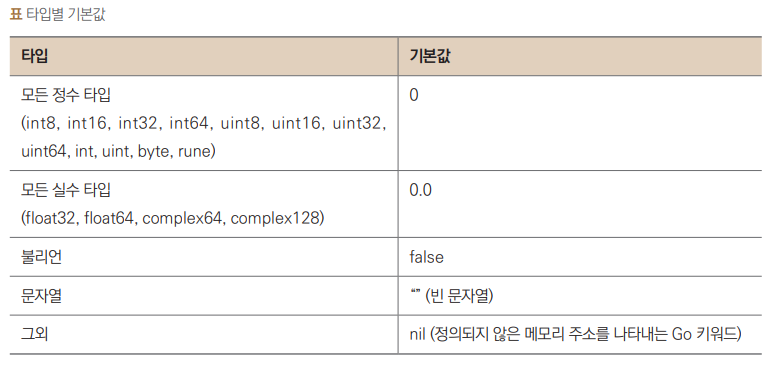

# Go lang Study
Go 언어를 학습하고 실습하기 위한 자료들을 포함하고 있습니다. 다양한 예제 코드, 프로젝트, 그리고 학습 자료들이 포함되어 있습니다.
참고 자료: [wikidocs - Go 언어 입문](https://wikidocs.net/book/13312)

# Go 언어 특징



## [**코드가 실행되기까지**](https://wikidocs.net/221536)

### 1 폴더 생성

Go 언어에서 모든 코드는 패키지 단위로 작성됩니다. 

같은 폴더에 위치한 .go 파일은 모두 같은 패키지에 포함되고, 패키지명으로 폴더명을 사용합니다

### 3 Go 모듈 생성

Go 1.16 버전 이후로 Go 모듈이 기본으로 적용됩니다. 따라서 모든 Go 코드는 빌드하기 전에 모듈을 생성해야 합니다.

모듈 생성은 go mod init 명령으로 실행합니다. go mod init 뒤에 모듈 이름을 적어주면 됩니다. 여기서는 폴더명과 같은 goproject/hello를 넣어줍니다.

```bash
go mod init goproject/hello
```

Go 모듈을 생성하면 go.mod 파일이 생성됩니다. go.mod 파일에는 모듈명과 Go 버전, 필요한 패키지 목록 정보가 담겨 있습니다. 자세한 사항은 16장에서 다루겠습니다.

### 4 빌드

go build 명령은 Go 코드를 기계어로 변환하여 실행 파일을 만듭니다. GOOS와 GOARCH 환경변수를 조정해서 다른 운영체제와 아키텍처에서 실행되는 실행 파일을 만들 수 있습니다. 터미널에서 go tool dist list 명령을 실행하면 가능한 운영체제와 아키텍처 목록을 볼 수 있습니다.

예를 들어 AMD64 계열 칩셋을 사용하는 리눅스 실행 파일을 만들 때는 다음과 같이 옵션을 주면 됩니다.

```
GOOS=linux GOARCH=amd64 go build
```

### 5 실행

이렇게 만들어진 실행 파일을 명령어로 실행하면 됩니다

# **Hello Go World 코드 뜯어보기**

```go
ch3/ex3.1/ex3.1.go

// ① 이 코드가 어떤 패키지에 속하는지, 
//main 패키지에 속한 코드임을 컴파일러에게 알려줍니다.
//‘Go 언어는 패키지 선언으로 시작되어야 한다’는 점과 
//‘package main은 프로그램 시작점이 있 는 패키지다’라는 점만 기억하면 됩니다.

package main

import "fmt" // ② fmt 패키지는 표준 입출력을 다루는 내장 패키지

func main() { // ③
     // Hello Go World 출력 // ④
     fmt.Println("Hello Go World") // ⑤
} // ⑥
```

# 변수

## 변수 선언



① var는 변수의 영문인 variable의 약자로 변수 선언을 알리는 키워드

② 이어서 변수 이름을 적습니다.

③ 그다음은 타입을 적습니다. 

④ 대입 연산자 = 오른쪽에 초깃값을 적어서 변수 선언을 마칩니다. 

```go
ch4/ex4.2/ex4.2.go

package main

import "fmt"

func main() {
  var minimumWage int = 10 // ① 변수 minimumWage 선언 및 초기화
  var workingHour int = 20 // ② 변수 workingHour 선언 및 초기화

  // ③ 변수 income 선언 및 초기화
  var income int = minimumWage * workingHour 

  // 변수 minimumWage, workingHour, income 출력
  fmt.Println(minimumWage, workingHour, income) 
}

10 20 200

```

① , ② 정수 타입 변수를 선언하고 초기화합니다. 정수 타입 변수 minimumWage와 workingHour를 선언하고 값으로 각각 10과 20을 대입합니다. 

컴퓨터는 ① 을 실행할 때 메모리에 정수 타입 데이터를 저장할 공간을 만들고 → minimumWage라고 지칭한 뒤 → 값 10을 복사합니다. 이제 minimumWage라는 변수명을 이용해서 해당 공간에 접근할 수 있습니다.



## 변수 더 알아보기
Go 언어는 숫자, 불리언, 문자열, 배열, 슬라이스, 구조체, 포인터, 함수, 인터페이스, 맵, 채널 등의 타입을 제공합니다.

### 숫자 타입



### 그외
- boolean : 참과 거짓 두 값만 가지는 타입입니다. bool로 선언하고 참은 true, 거짓은 false로 씁니다.
문자열 : 문자열 타입의 키워드는 string입니다(15장 ‘문자열’ 참조).
- array : 같은 타입의 요소들로 이루어진 연속된 메모리 공간을 나타내는 자료구조입니다(12장 ‘배열’ 참조).

- slice : Go 언어에서 제공하는 가변 길이 배열을 말합니다. 배열은 고정 길이로써 한 번 길이가 정해지면 늘리거나 줄일 수 없는 반면 슬라이스는 길이를 늘리거나 줄일 수 있습니다(18장 ‘슬라이스’ 참조).

- 구조체 : 필드(변수)의 집합 자료구조입니다. 보통 상관관계가 있는 데이터를 묶어놓을 때 사용합니다. 예를 들어 회원 구조체는 회원ID, 회원명, 주소 등의 필드로 구성할 수 있습니다(13장 ‘구조체’ 참조).

- 포인터 : 메모리 주소를 값으로 갖는 타입입니다. 포인터를 이용해서 같은 메모리 공간을 가리키는 여러 변수를 만들 수 있습니다(14장 ‘포인터’ 참조).

- 함수 타입 : 함수를 가리키는 타입입니다. 다른 말로 함수 포인터라고 말합니다. 사용할 함수를 동적으로 바꿀 때 유용합니다(21장 ‘함수 고급편’ 참조).
- 인터페이스 : 메서드 정의의 집합입니다(20장 ‘인터페이스’ 참조).
- 맵 : key와 value을 갖는 데이터를 저장해둔 자료구조입니다. 키를 사용해 데이터를 찾는 데 특화된 자료구조입니다. 쉽게 전화번호부나 사전을 생각하시면 됩니다(22장 ‘자료구조’ 참조). 
- channel : 멀티스레드 환경에 특화된 큐 형태 자료구조입니다

## 변수 선언의 다른 형태

```go
var b = 3.1415 // b는 float64 타입으로 자동 지정됩니다.
c := 365 // c는 int 타입으로 자동 지정됩니다.
s := "hello world" // s는 string 타입으로 자동 지정됩니다. 
```

### 타입별 기본값

변수를 선언할 때 초깃값을 생략하면 다음과 같은 기본값이 자동 대입됩니다.


### 선언 대입문 :=

선언 대입문이란 말 그대로 선언과 대입을 한꺼번에 하는 구문입니다. 선언 대입문을 사용하면 var 키워드와 타입을 생략해 변수를 선언할 수 있습니다.

## 타입 변환
프로그래밍 언어를 구분할 때 타입 검사를 하는가 안 하는가에 따라 강 타입 언어와 약 타입 언어로 나눕니다. Go 언어는 강 타입 언어 중에서도 가장 강하게 타입 검사를 하는 최강 타입 언어입니다.

```go
a := 3 // int
var b float64 = 3.5 // float64

var c int = b // Error - float64 변수를 int에 대입 불가
d := a * b // Error - 다른 타입인 int 변수와 float64 연산 불가

var e int64 = 7
f := a * e // Error - a는 int 타입, e는 int64 타입으로 같은 정수값이지만
 // 타입이 달라서 연산 불가
```

```go
ch4/ex4.4/ex4.4.go

package main

import "fmt"

func main() {
 a := 3 // int
 var b float64 = 3.5 // float64

 var c int = int(b) // ① float64에서 int로 변환
 d := float64(a * c) // int에서 float64로 변환

 var e int64 = 7
 f := int64(d) * e // float64에서 int64로 변환

 var g int = int(b * 3) // ② float64에서 int로 변환
 var h int = int(b) * 3 // ③ float64에서 int로 변환. g와 값이 다릅니다. 
 fmt.Println(g, h, f)
}
10 9 63
```

- 실수 타입에서 정수 타입으로 타입 변환하면 소수점 이하 숫자가 없어진다

- 큰 범위를 갖는 타입에서 작은 범위를 갖는 타입으로 변환하면 값이 달라질 수 있다

```go
ch4/ex4.5/ex4.5.go

package main

import "fmt"

func main() {
  var a int16 = 3456
  var c int8 = int8(a) // ① int16 타입에서 int8 타입으로 변환

  fmt.Println(a)
  fmt.Println(c) // ② int8타입인 c값 출력
}
3456
-128
```
